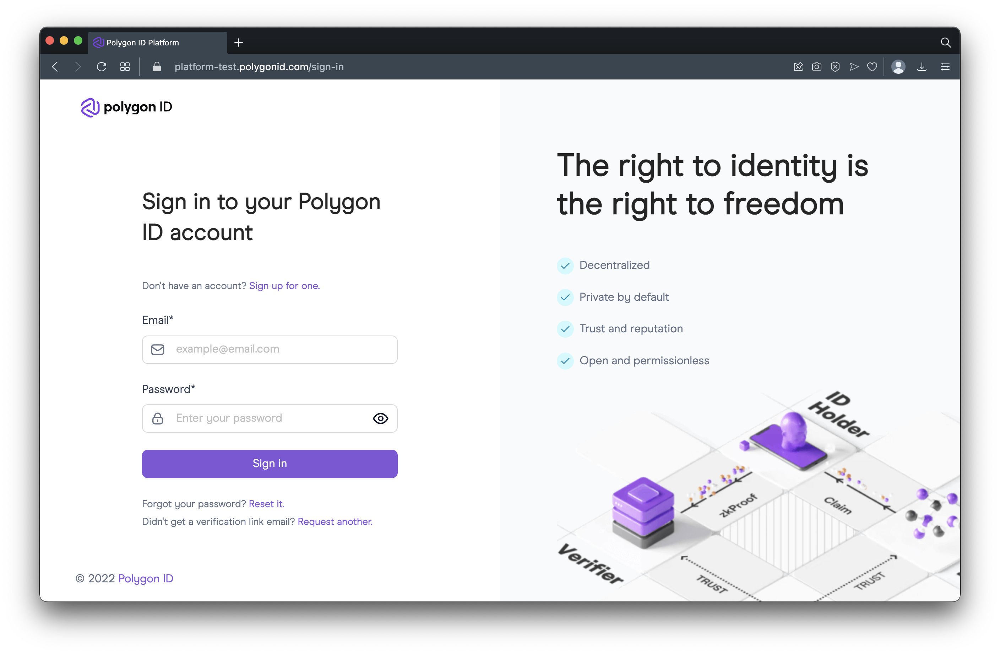

# PolygonID On Chain Verifications

A basic tutorial on how to deploy a contract, and go through the proof process.

---

## TOC


---

## Requirements

- NVM Node v16.17.0
- Yarn v1.22.19

---

## Concept

There are 3 entities in SSI (Self-Sovereign Identify) for the "Trust Triangle" ([https://www.okta.com/identity-101/self-sovereign-identity/](https://www.okta.com/identity-101/self-sovereign-identity/)).

1 - Owner

2 - Issuer

3 - Verifier

---

## Deploy ERC20 Token

### Step 1 - Create Configuration Files & Install Dependencies

```bash
cp .env.example .env;

yarn;
```

Fill in the following details to deploy the proper contract

**File:** `./.env`

```bash
ETHERSCAN_API_KEY=
RPC_MUMBAI_URL=
WALLET_PRIVATE_KEY=
```

### Step 2 - Deploy Contract

```bash
npx hardhat run scripts/erc20Deploy.ts --network mumbai;

# Expected output:
# Compiled x Solidity files successfully
# ERC20zkAirdrop deployed to 0xABc1...}
```

### Step 3 - Create Claim

A - Sign up for [https://platform-test.polygonid.com](https://platform-test.polygonid.com).



B - Create Schema


C - Claim


### Step 4 - Set ZKP Request

Modify the following file

**File:** `./scripts/erc20ZkpRequest.ts`

```ts
    // Change to copied schemaHas from claim in Step 2C
    const schemaHash = "9c2498080a90d43cada7fec79eeee8de";
    // Changed to deployed contract
    const ERC20VerifierAddress = "0x085523dF632FEaAE3Ae232E0EBc31FaC9956ddAb";
    const schemaEnd = fromLittleEndian(hexToBytes(schemaHash));
    const query = {
        schema: ethers.BigNumber.from(schemaEnd),
        slotIndex: 2,
        operator: 2,
        // Change to 10 or value that you want to use (eg. everything greater than 10)
        value: [10, ...new Array(63).fill(0).map(i => 0)],
        circuitId,
    };
```

Set it on the contract:

```bash
npx hardhat run --network mumbai scripts/erc20ZkpRequest.ts;

# Expected output:
# Request set at:
# NOTE: May take a little bit to show up
# https://mumbai.polygonscan.com/tx/0x60ac...
```

### Step 5 - QR Code Proof Request

Modify the following script:

**File:** `./htmlQRClaim/src/App.tsx`

```tsx
    // ...

    // Config
    // ========================================================
    // update with your contract address
    const DEPLOYED_CONTRACT_ADDRESS = "0xCfFEb70395C8E2A98d20Facf67122d638b18673c";

    /**
     * 
     */
    const qrProofRequestJson = proofRequest;
    qrProofRequestJson.body.transaction_data.contract_address = DEPLOYED_CONTRACT_ADDRESS;
    qrProofRequestJson.body.scope[0].rules.query.req = {
    "Date": {
        // NOTE: this value needs to match the erc20ZkpRequest.ts L34 or erc721ZkpRequest.ts L34
        "$gt": 10
    }
    };
    // NOTE1: if you change this you need to resubmit the erc10|erc721ZKPRequest
    // NOTE2: type is case-sensitive
    // You can generate new schemas via https://platform-test.polygonid.com
    qrProofRequestJson.body.scope[0].rules.query.schema = {
    "url": "https://s3.eu-west-1.amazonaws.com/polygonid-schemas/96c80e89-3c04-4762-8f4a-c39373571506.json-ld",
    "type": "MyCustomSchema"
    };
```

Run the local html QR code page

```bash
cd htmlQRClaim;
yarn dev;

# Expected output:
# VITE v3.2.0  ready in 238 ms
# 
#   ➜  Local:   http://127.0.0.1:5173/
#   ➜  Network: use --host to expose
```

### Step 6 - Mint Airdrop With Proof


---

## Debugging Errors

### Wrong Claim Schema Has Been Used For Proof Generation


Double check that that the schema has been set correctly in the following places:

**File:** `./scripts/erc20ZkpRequest.ts`

```ts
// This should be copied from https://platform-test.polygonid.com
const schemaHash = "f91912b9332bb22be08b4e10fe9eda9a"; 
```

AND

**Files:** `./htmlQRClaim/src/App.tsx`

```tsx
// This should match the url and the type from https://platform-test.polygonid.com
qrProofRequestJson.body.scope[0].rules.query.schema = {
  "url": "https://s3.eu-west-1.amazonaws.com/polygonid-schemas/96c80e89-3c04-4762-8f4a-c39373571506.json-ld",
  "type": "MyCustomSchema"
};
```

### Wrong Query Operator Has Been Used For Proof Generation


Double check that the operator and the code for the operator is set correctly in the following places:

**File:** `./scripts/erc20ZkpRequest.ts`

```ts
    const query = {
        schema: ethers.BigNumber.from(schemaEnd),
        slotIndex: 2,
        // see - https://0xpolygonid.github.io/tutorials/verifier/verification-library/zk-query-language/
        // 1 = equals
        // 2 = less-than
        // 3 = greater-than
        // 4 = in
        // 5 = not-in
        operator: 3,
        value: [10, ...new Array(63).fill(0).map(i => 0)],
        circuitId,
    };
```

AND

**Files:** `./htmlQRClaim/src/App.tsx`

```tsx
qrProofRequestJson.body.scope[0].rules.query.req = {
  "customNumberAttribute": {
    // see - https://0xpolygonid.github.io/tutorials/verifier/verification-library/zk-query-language/
    // NOTE: this value needs to match the erc20ZkpRequest.ts L34 or erc721ZkpRequest.ts L34
    // $eq = 1
    // $lt = 2
    // $gt = 3
    // $in = 4
    // $nin = 5
    "$gt": 12
  }
};
```

### Wrong Comparison Value Has Been Used For Proof Generation


Double check that the value used for the condition is set correctly in the following places:

**File:** `./scripts/erc20ZkpRequest.ts`

```ts
    const query = {
        schema: ethers.BigNumber.from(schemaEnd),
        slotIndex: 2,
        operator: 3,
        // Make sure this value (ex: 10) matches the other value
        value: [10, ...new Array(63).fill(0).map(i => 0)], 
        circuitId,
    };
```

AND

**Files:** `./htmlQRClaim/src/App.tsx`

```tsx
qrProofRequestJson.body.scope[0].rules.query.req = {
  "customNumberAttribute": {
    // Make sure this value (ex: 10) matches the other value
    "$gt": 10
  }
};
```

### Proof Can Not Be Submitted More Than Once


This is because you can only mint once with that specific proof.

---

## Deploy ERC721 Token

### Step 1 - Create Configuration Files & Install Dependencies For ERC721

[See ERC20 - Step 1](#step-1---create-configuration-files--install-dependencies)

### Step 2 - Deploy Contract For ERC721

```bash
npx hardhat run scripts/erc721Deploy.ts --network mumbai;

# Expected output:
# Compiled x Solidity files successfully
# ERC721zkMint deployed to 0xABc1...}
```

### Step 3 - Create Claim For ERC721

[See ERC20 - Step 3](#step-3---create-claim)

### Step 4 - Set ZKP Request For ERC721

Modify the following file

**File:** `./scripts/erc721ZkpRequest.ts`

```ts
    // Change to copied schemaHas from claim in Step 2C
    const schemaHash = "9c2498080a90d43cada7fec79eeee8de";
    // Changed to deployed contract
    const ERC721VerifierAddress = "0x085523dF632FEaAE3Ae232E0EBc31FaC9956ddAb";
    const schemaEnd = fromLittleEndian(hexToBytes(schemaHash));
    const query = {
        schema: ethers.BigNumber.from(schemaEnd),
        slotIndex: 2,
        operator: 2,
        // Change to 10 or value that you want to use (eg. everything greater than 10)
        value: [10, ...new Array(63).fill(0).map(i => 0)],
        circuitId,
    };
```

Set it on the contract:

```bash
npx hardhat run --network mumbai scripts/erc721ZkpRequest.ts;

# Expected output:
# Request set at:
# NOTE: May take a little bit to show up
# https://mumbai.polygonscan.com/tx/0x60ac...
```

### Step 5 - QR Code Proof Request For ERC721

[See ERC20 - Step 5](#step-5---qr-code-proof-request)

### Step 6 - Mint NFT With Proof For ERC721

[See ERC20 - Step 6](#step-6---mint-airdrop-with-proof)

### Step 7 - See On OpenSea

Go to your [OpenSea Account](https://testnets.opensea.io/account), connect your wallet, and see the minted hex colour nft.


